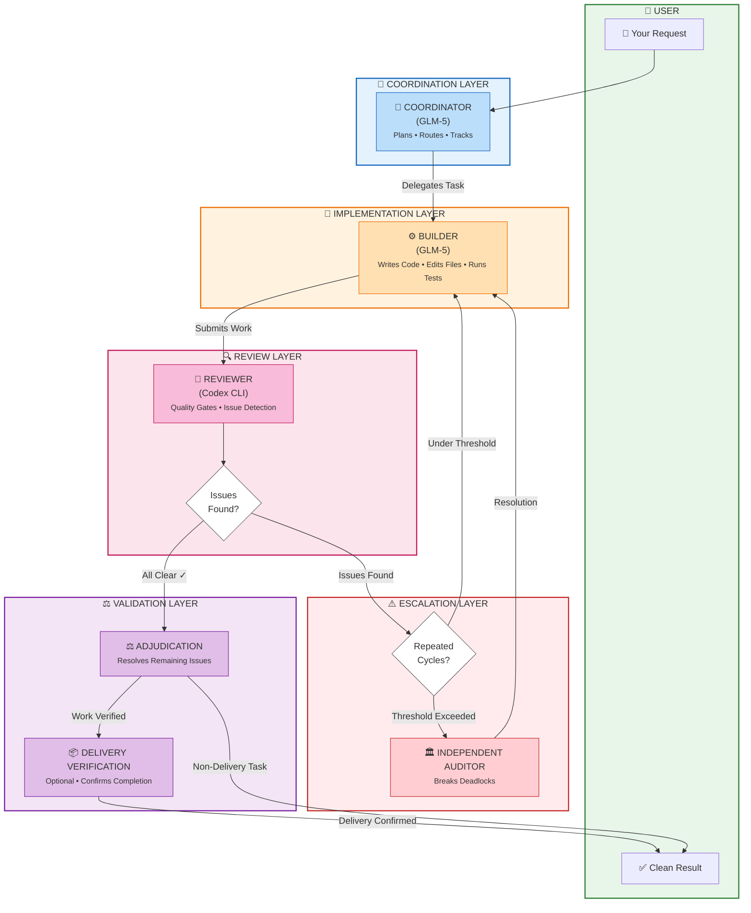
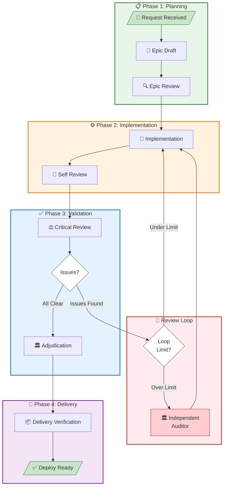

# Dual Agents User Guide

Welcome to Dual Agents! This guide will help you understand what this tool does, why you might want to use it, and how to get started.

> **Important:** This repository is a **portable scaffold**—it exports workflow assets (configuration files, agent definitions, commands) into *your* projects. Day-to-day coding happens in your target project, not here. Think of this as an installer/template toolkit rather than a working directory.

---

## What is Dual Agents?

**Dual Agents** is a Python toolkit that uses *two* AI agents working together to complete coding tasks with higher quality and reliability.

Think of it like having a **builder and a reviewer** on your team:

- **The Builder** writes code, edits files, and does the hands-on implementation work
- **The Reviewer** critically examines the work, catches mistakes, and ensures quality

These two agents work under the supervision of a **Coordinator** that keeps everything organized and on track.

### A Simple Analogy

Imagine you're building a house. You wouldn't want just one person doing everything—designing, building, and inspecting. Instead, you'd have:

1. **A builder** who does the construction work
2. **An inspector** who checks the work meets standards
3. **A project manager** who coordinates between them

Dual Agents applies this same principle to AI-assisted coding. Instead of trusting one AI to do everything, you get a team that checks each other's work.

---

## Why Use It?

### The Real Benefit: Verification, Not Just Assistance

Here's what makes dual-agent workflows actually valuable:

**Multiple models verify each other's work.** GLM-5 builds. Codex reviews. Neither works in isolation. When one model creates something, another independently evaluates it. This isn't redundancy—it's the difference between "I think this is right" and "Someone else confirmed this is right." A *review gate* is a checkpoint where the reviewer steps in—for example, before marking work complete or when claiming something is blocked—rather than running constantly during implementation.

**You save tokens without sacrificing quality.** The reviewer only runs at critical gates—when decisions matter—not constantly during implementation. This means you're not burning premium model tokens on every keystroke. Use the cheaper model for the heavy lifting; invoke the premium model only when you need a second opinion.

**In our experience, this approach can achieve quality comparable to or better than running a single premium model end-to-end.** A single agent, no matter how capable, has blind spots. Two focused agents with distinct roles often catch what one misses.

### Why Not Just Use "Agent Teams"?

You've probably seen frameworks like AutoGen, CrewAI, or LangGraph's multi-agent patterns. They're popular and can be configured in lighter-weight ways, but in their common usage patterns, they're often the wrong tool for simple verification needs.

Here's the uncomfortable truth: **running 3-5+ agents simultaneously is often expensive token burn.** More agents having more conversations doesn't necessarily produce better output—it often produces more output—more tokens, more noise, more confusion.

The problem with agent teams (when configured to run simultaneously):
- Every agent runs on every step = compounding costs
- More conversations = more chances to go off track
- Consensus-seeking can dilute strong decisions
- You're paying for volume, not verification

**Dual-agent is minimal but sufficient.** Two model-powered agents plus orchestration logic. Focused interaction. The Builder does. The Reviewer checks. The Coordinator keeps things on track. No committee meetings. No endless debates. No theatrical "collaboration" that burns tokens without adding value.

Quality comes from **structured review gates**, not more agents talking.

### The "More ≠ Better" Insight

Most people assume: more AI agents = more things done = better results.

**This assumption doesn't hold in practice.**

- More agents = more noise, more cost, more confusion
- More conversations = more chances to go off track
- More "collaboration" often means mediocrity through compromise

Better output comes from **verification**, not volume. One agent builds. One agent verifies. Done.

Dual-agent focuses on **quality checkpoints**, not quantity. Every review gate exists because it matters—not because we needed an excuse for another agent to chime in.

### The Cost Equation

| Approach | Token Usage | Quality |
|----------|-------------|---------|
| Single premium model | High (runs constantly) | Good, but no verification |
| Agent teams (3-5 agents) | Very high (all run constantly) | Can be high, depends on coordination |
| Dual-agent workflow | Moderate (reviewer runs at gates only) | Verified, focused, efficient |

If you're going to spend tokens, spend them where they matter: on verification at critical moments, not on keeping five agents in an endless group chat.

---

## How It Works

### Workflow Architecture

The diagram below shows how your request flows through the dual-agent system—from the moment you make a request until you receive verified, production-ready output.



### The Three Roles

```
┌─────────────────────────────────────────────────────────────────┐
│                         COORDINATOR                              │
│              (Orchestrates the entire workflow)                  │
│                                                                  │
│    • Plans the work                                              │
│    • Decides when to use each agent                              │
│    • Tracks progress through workflow stages                     │
│    • Handles escalations and disputes                            │
└─────────────────────────────────────────────────────────────────┘
              │                              │
              ▼                              ▼
┌──────────────────────────┐    ┌──────────────────────────┐
│       BUILDER            │    │        REVIEWER          │
│      (GLM-5)             │    │     (Codex CLI)          │
│                          │    │                          │
│  • Writes code           │    │  • Reviews code          │
│  • Edits files           │    │  • Catches issues        │
│  • Runs tests            │    │  • Validates decisions   │
│  • Fixes bugs            │    │  • Approves or requests  │
│                          │    │    changes               │
└──────────────────────────┘    └──────────────────────────┘
```

### Diagram Legend

| Element | Meaning |
|---------|---------|
| **👤 User** | You—the person making the request and receiving the result |
| **🧠 Coordinator** | GLM-5 agent that plans work, routes tasks, and tracks progress |
| **⚙️ Builder** | GLM-5 agent that implements code, edits files, and runs tests |
| **🔎 Reviewer** | Codex CLI agent that checks work at quality gates |
| **⚖️ Adjudication** | Resolves any remaining issues after review passes |
| **📦 Delivery Verification** | Optional final check for delivery-sensitive work |
| **🏛️ Independent Auditor** | Fallback mechanism when repeated review cycles persist |
| **Diamond shapes** | Decision points where the workflow branches |

### When Does Loop-Back Happen?

The workflow returns work to the Builder when the Reviewer finds:
- **Blocking issues**: Bugs, errors, or problems that must be fixed
- **Incomplete work**: Missing requirements or unfinished components
- **Quality concerns**: Code that doesn't meet standards

### When Does Escalation Occur?

The Independent Auditor steps in when:
- **Repeated review cycles**: The same issue cluster has gone through multiple review/fix rounds without resolution
- **Persistent disagreements**: Builder and Reviewer can't reach consensus
- **Stuck workflow**: Progress has stalled despite multiple attempts

> **Note:** Forum Adjudication is an **experimental and optional** feature (disabled by default). When enabled, it triggers based on `repeated_review_cycles` thresholds rather than a fixed round cap.

#### Builder Agent (GLM-5)

The Builder is your implementation workhorse. It:

- Receives bounded, specific tasks from the Coordinator
- Makes code changes, edits files, and runs tests
- Reports back with structured results (what changed, what tests ran, any blockers)
- Stays focused on one task at a time

#### Reviewer (Codex CLI)

The Reviewer provides independent, critical assessment. It:

- Examines code at review gates
- Identifies blocking issues that must be fixed
- Notes non-blocking issues for future improvement
- Validates that work is truly complete before moving on

#### Coordinator

The Coordinator is the brain of the operation. It:

- Understands the big picture of your request
- Breaks complex work into manageable pieces
- Routes work to the right agent at the right time
- Makes decisions about when to escalate or pause
- Ensures the workflow follows proper stages

---

## Workflow Overview

### The Journey from Request to Completion

> **Note:** The stages below represent the internal workflow state machine defined in `src/dual_agents/workflow.py`. You don't need to interact with these directly—the system manages them automatically.



### Visual Flow (Alternative View)

```
  Your Request
       │
       ▼
╔═════════════════╗
║ REQUEST RECEIVED║
╚════════╤════════╝
         │
         ▼
┌─────────────────┐     ┌─────────────────┐
│   EPIC DRAFT    │────▶│   EPIC REVIEW   │
└─────────────────┘     └────────┬────────┘
                                 │
         ┌───────────────────────┘
         ▼
┌─────────────────┐     ┌─────────────────┐
│ IMPLEMENTATION  │────▶│  SELF REVIEW    │
└────────┬────────┘     └────────┬────────┘
         │                       │
         │    ┌──────────────────┘
         │    │
         ▼    ▼
╔═══════════════════════════════════════════╗
║           CRITICAL REVIEW                 ║
║     (Independent reviewer checks work)    ║
╚═════════════════════╤═════════════════════╝
                      │
          ┌───────────┴───────────┐
          │                       │
    Issues Found?           All Clear!
          │                       │
          ▼                       ▼
   ┌──────────────┐         ╔═══════════════╗
   │  Loop Back   │         │ ADJUDICATION  │
   │ (max 5x)     │         ╚═══════╤═══════╝
   └──────┬───────┘                 │
          │    ┌────────────────────┘
          │    │
          ▼    ▼
┌─────────────────────┐
│ DELIVERY VERIFICATION│
│   (if required)      │
└──────────┬──────────┘
           │
           ▼
╔═════════════════════╗
║    DEPLOY READY     ║
║    ✓ Complete!      ║
╚═════════════════════╝
```

### Workflow Stages Explained

| Stage | What Happens |
|-------|--------------|
| **Request Received** | Your task is captured and understood |
| **Epic Draft** | A plan is created for how to tackle the work |
| **Epic Review** | The plan is reviewed before implementation starts |
| **Implementation** | The Builder does the actual coding work |
| **Self Review** | Initial check of the implementation |
| **Critical Review** | Independent Reviewer examines everything |
| **Adjudication** | Any remaining issues are resolved |
| **Delivery Verification** | Final proof that work is complete |
| **Deploy Ready** | Work is finished and ready to ship |

### What Happens When Issues Are Found?

If the Critical Review finds blocking issues, the workflow loops back to Implementation for fixes. But there's a limit—after several rounds, an **Independent Auditor** steps in to check if you're going in circles and need a different approach.

---

## Key Features

### Structured Review Gates

Not every decision gets reviewed—that would be slow and expensive. Instead, reviews happen at critical moments:

- **New tasks**: Starting something brand new
- **Sequence changes**: Changing the order of work
- **Exception handling**: Deciding to skip or modify planned work
- **Blocker claims**: When something can't be done as planned
- **Ambiguous situations**: When status is unclear

> **Note:** Codex (the reviewer) is intentionally invoked only at review gates, not for ordinary chat or simple queries. This keeps costs reasonable while ensuring quality at critical decision points.

### Loop Prevention

The system has built-in protections against endless cycles:

- **Loop budget**: Maximum of 5 review/fix rounds per issue cluster
- **Independent Auditor**: Steps in when loops persist
- **Forum Adjudication** *(experimental)*: For complex disputes, a moderator makes a final ruling

### Clean Output

The system enforces clean, user-facing output by:

- Filtering out internal reasoning and thinking tags
- Preventing tool syntax from leaking into responses
- Requiring structured formats for reviews and results

### Bounded Tasks

The Builder only accepts one clear, bounded task at a time—not chains like "do X and Y and then Z." This keeps work focused and verifiable.

---

## Getting Started

### Prerequisites

Before you start, make sure you have:

1. **OpenCode** installed and on your PATH
2. **Codex CLI** installed and logged in (`codex --login`)
3. **GLM API Key** from Z.AI

### Quick Setup

```bash
# 1. Clone the repository
git clone <your-fork-or-this-repo>
cd dual-agents

# 2. Create and activate a virtual environment
python -m venv .venv
source .venv/bin/activate

# 3. Install the package
pip install -e .

# 4. Set your API key
export GLM_API_KEY=your_key_here

# 5. Verify your setup
dual-agents doctor
```

### Initialize a Target Project

To use Dual Agents with your own project:

```bash
dual-agents init-target --output-dir /path/to/your-project
```

This creates the necessary configuration files in your target project:

- `.opencode/opencode.json` - OpenCode configuration
- `.opencode/agents/*.md` - Agent definitions
- `.opencode/commands/dual.md` - Dual workflow command
- `.dual-agents/codex-review.txt` - Review template

> **Preview before initializing:** If you want to inspect the generated assets before writing them to your project, you can use:
> - `dual-agents preview` — Shows what files would be created
> - `dual-agents export` — Exports assets to a directory for manual review

After initialization, commit these files to your target repository.

### Using the Workflow

Once initialization is complete, here's how to actually use the workflow:

1. **Open your TARGET project** — Navigate to the repository where you ran `dual-agents init-target`. This is where your actual code lives.
   
2. **Start OpenCode in that directory** — The `/dual` command and phrase triggers only work in the target repo with the generated OpenCode assets.

3. **Trigger the workflow** by either:
   - Using the `/dual` command with your request: `/dual Add error handling to the payment module`
   - Including the phrase "sort it out with dual agent workflow" in your message

> **Important:** Do NOT try to use the workflow from this scaffold repository. The workflow commands are installed into your target project during initialization.

---

## Common Use Cases

### When to Use Dual Agents

Dual Agents is particularly valuable for:

#### Complex Implementation Tasks

When you need code written that:
- Has multiple interacting components
- Requires careful attention to edge cases
- Could benefit from a second set of eyes

#### Quality-Critical Work

When mistakes would be costly:
- Production deployments
- Security-sensitive code
- Data migration scripts
- API changes affecting multiple systems

#### Uncertain or Ambiguous Requirements

When you're not 100% sure of the best approach:
- The Reviewer can help validate decisions
- The Coordinator can escalate for human input
- The structured workflow ensures nothing is missed

#### Learning and Exploration

When you want to understand how AI agents can work together:
- See how different models approach the same problem
- Understand the value of structured workflows
- Learn about review gates and quality assurance

### When You Might Not Need It

For simple, straightforward tasks, the overhead might not be necessary:

- Quick typo fixes
- Simple configuration changes
- Well-defined, low-risk updates

---

## Tips for Success

### Write Clear Requests

The clearer your initial request, the better the results:

- **Be specific** about what you want
- **Provide context** about your project
- **Mention constraints** or requirements
- **Clarify priorities** if there are trade-offs

### Trust the Process

The workflow is designed to catch issues:

- Don't rush past review gates
- Let the system complete its checks
- Review the feedback from the Reviewer

### Check the Logs

For complex multi-round work, check the run logs:

- `epic/<epic-name>/<task>-dual-agent-log.md`
- `epic/<epic-name>/<task>-codex-review-round*.md`

These capture what happened in each round and help you understand the journey.

---

## Getting Help

- Check the `README.md` for technical documentation
- Review `dual-agent-features-master.md` for detailed capabilities
- Look at `docs/` for specialized topics like forum adjudication

---

## Summary

Dual Agents gives you the power of two AI agents working together—a Builder that does the work and a Reviewer that ensures quality—all coordinated through a structured workflow that prevents common AI coding pitfalls.

By separating implementation from review and adding proper workflow controls, you get more reliable, higher-quality results from AI-assisted coding.

**Happy coding!**
